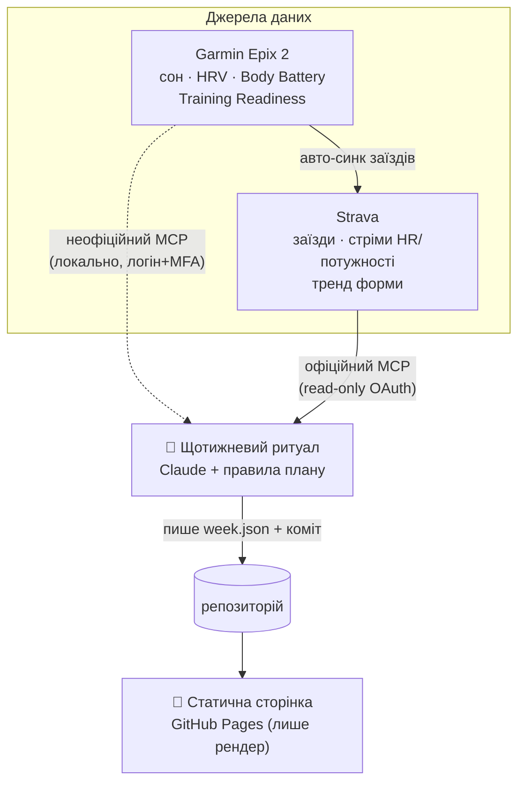

# Інтеграції Strava + Garmin: аналіз і архітектура live-планувальника

> Статус: аналіз (рішення ще не ухвалене, код не написаний).
> Дата: 2026-07-22. Оновлювати, коли Strava/Garmin змінять умови або з'явиться реалізація.

## Мета

Перетворити статичний план (`index.html`) на **адаптивний тренувальний контур**:
раз на тиждень дивимось на те, що реально сталося з тілом за минулий тиждень
(навантаження + відновлення), і переписуємо наступний тиждень під ці показники.
Пріоритет — **реалістичність плану**, а не «фічі заради фіч».

Вхідні дані користувача:
- Платна підписка Strava — **є** (потрібна для офіційного MCP).
- Годинник — **Garmin Epix 2 (Gen 2)**: повний набір wellness-метрик.
- Готовий погодитись на **готове рішення**, зокрема неофіційний Garmin-конектор.

---

## TL;DR / рішення

1. **DIY-шлях «мій бекенд смикає REST API Strava → віддає в LLM» — заборонений**
   новою API-угодою Strava (діє з 01.06.2026). Це не обхідне обмеження — це прямий
   пункт про AI.
2. **Того ж дня Strava відкрила легальний канал рівно під наш сценарій — офіційний
   Strava MCP.** Read-only, OAuth, для підписників, аналіз **власних** даних через
   Claude. Уже підключений у робочих сесіях (`mcp__Strava__*`).
3. **Офіційний Garmin API для фізосіб закритий** (бізнес-програма + зараз на паузі).
   **Неофіційний** local-first конектор працює через звичайний логін і дає recovery-дані,
   яких у Strava немає (HRV, сон, Body Battery, Training Readiness).
4. Архітектура: **два шари** — «щотижневий ритуал» (Claude + MCP рахує) і «дашборд»
   (статична сторінка лише показує). Сторінка **ніколи** не торкається API напряму.

Рекомендація: **офіційний Strava MCP (навантаження) + неофіційний локальний Garmin MCP
(відновлення) + щотижневий Claude-ритуал, що комітить `week.json` у репо → сторінка рендерить.**

---

## 1. Strava

### Що змінилось (API Agreement, чинна з 01.06.2026)

Нова угода прямо забороняє:
- передавати Strava-дані в будь-який AI — включно з «ingestion into a context window
  or working memory», RAG, тренуванням/оцінкою моделей;
- будь-яку аналітику та «insight generation» **навіть на знеособлених/агрегованих** даних;
- комбінувати Strava-дані з іншими даними користувача;
- показувати дані інших атлетів у власному застосунку (крім вузьких винятків).

Практичний наслідок: **не можна** зробити власний сервіс, що читає Strava REST API і
згодовує це LLM-планувальнику. Саме цей шлях ми і планували в «етапі 2» — його треба
відкинути.

### Легальний шлях — офіційний Strava MCP

Strava запустила власний хостований MCP-сервер (`mcp.strava.com/mcp`) — за їхнім
формулюванням «єдиний авторизований first-party агентний інтерфейс». Характеристики:

- **Read-only**, OAuth. Не може завантажувати/редагувати активності.
- Тільки **власні** дані підписника, через Claude (web / desktop / Claude Code).
- Дає: історію активностей, **per-second стріми HR / pace / потужності**, GPS-маршрути,
  зони, gear, club/event, тренди форми, і — прямо їхніми словами — **readiness та
  goal planning**.
- Потрібна **платна підписка** (у нас є).

Тобто персональний AI-аналіз власного тренування — це **санкціонований** сценарій.
Обмеження стосуються побудови продуктів на чужих даних через REST, не нашого кейсу.

> Застереження: це прочитання умов, не юридичний висновок. Умови змінюються — перевіряти
> перед будь-якою публічною/комерційною версією. Для суто особистого використання через
> офіційний MCP ризик мінімальний.

---

## 2. Garmin

### Офіційний шлях — практично закритий

Garmin Connect Developer Program (Health / Activity / Training API) — **тільки для
компаній**, за заявкою з корпоративними даними, **і наразі на паузі** для нових
реєстрацій. Для фізособи як шлях не розглядаємо.

### Неофіційний шлях — робочий

`python-garminconnect` / готові обгортки типу `garmin-mcp` (local-first MCP):

- **Не потребує developer-акаунту** — звичайний логін Garmin Connect + MFA.
- **Local-first**: креди питаються локально, зберігаються лише короткоживучі токени
  (`~/.garmin-mcp/…`), пароль не зберігається, MCP-клієнт кредів не бачить.
- Дає з Epix 2: **сон і фази, HRV Status, Body Battery, stress, Training Readiness,
  Training Status, Recovery Time, дихання, SpO2, VO₂max, Training Load**, активності,
  вагу/склад тіла.

**Ризики (чесно):**
- Порушує ToS Garmin (неофіційний доступ). Для особистого використання практичний
  ризик низький, але він є.
- Крихкість: ламається, якщо Garmin змінить приватні ендпоінти чи авторизацію.
- Тротлінг: часті headless-логіни можуть посилити обмеження. Логінитись рідко,
  кешувати токен.
- **Потрібен локальний запуск** (логін + MFA) — цей шар не можна безпечно винести
  повністю в хмару.

### Важливо для реалізму

Epix 2 **сам обчислює Training Readiness** — композит зі сну, історії сну, HRV,
Recovery Time, гострого навантаження і стресу. Тобто нам не треба перевинаходити
«готовність» — можна споживати готовий Garmin-скор і накладати на нього правила плану.

---

## 3. Перекриття даних і поділ праці

Garmin Epix 2 **автоматично зливає заїзди в Strava**. Тому дані про *навантаження*
вже легально доступні через офіційний Strava MCP. А *відновлення* живе тільки в
Garmin Connect. Звідси чистий поділ:

| Шар | Джерело | Легальність | Що дає |
|---|---|---|---|
| **Навантаження** (що я зробив) | Strava, офіційний MCP | ✅ санкціоновано | заїзди, per-second HR/потужність, обсяг, тренд форми/свіжості |
| **Відновлення** (чи готове тіло) | Garmin, неофіційно локально | ⚠️ сіра зона ToS | HRV-тренд, сон, Body Battery, Training Readiness |

Реалістичний тижневий план потребує **обох**: навантаження (чи зроблено роботу) +
відновлення (чи можна докласти). Це data-driven версія твого власного правила
«нарощуєш тільки якщо контрольовано».

---

## 4. Архітектура live-планувальника



**Шар А — щотижневий ритуал (тут живе весь інтелект).**
Раз на тиждень запускається Claude-сесія з підключеними Strava MCP (офіційний) +
Garmin MCP (неофіційний, локальний). Claude:
1. читає навантаження минулого тижня зі Strava (обсяг, довгий, середній пульс,
   тренд форми);
2. читає відновлення з Garmin (7-денний HRV-тренд, сон, Body Battery low,
   Training Readiness);
3. застосовує правила плану (крок угору / hold / deload, діагностика контактних
   точок, темп у розмовній зоні);
4. пише `week.json` і комітить у репо.

**Шар Б — дашборд (те, що вже зроблено).**
Сторінка читає `week.json` і показує актуальний адаптований тиждень + погоду.
API напряму **не торкається** — статика лишається статикою, секрети поза браузером,
все легально.

Чому саме так, а не бекенд із кнопкою «Generate»:
- умови Strava забороняють шлях «сервіс тягне API → LLM»;
- client-side OAuth = секрети в браузері;
- Garmin-неофіційний вимагає локального логіну — на сервері це і небезпечно, і крихко.

---

## 5. «Згенерувати прямо на сайті» — що реально можливо

Це найбажаніше і водночас найпроблемніше. Чесна драбина варіантів від реалістичного
до ні:

**A. Ручний щотижневий ритуал (рекомендовано для v1).**
Ти запускаєш Claude-сесію (напр., тут у Claude Code), обидва MCP, Claude комітить
`week.json`, сторінка оновлюється. «На сайті» = лише показ + мітка «оновлено N днів тому».
Просто, легально, працює з обома джерелами.

**B. Напівавтомат (Strava-only у хмарі).**
Розклад (cron / scheduled trigger) щопонеділка піднімає Claude-сесію, робить
**Strava-частину** автоматично і комітить. Garmin-частина все одно потребує локального
запуску. Гібрид: навантаження оновлюється саме, відновлення — коли ти вдома запускаєш локально.

**C. Кнопка «Згенерувати» на самій сторінці (не рекомендовано).**
Потребує бекенду; на Strava — порушення умов; Garmin-креди на сервері — погано з безпеки.
Це неправильний пагорб.

**Найближче до мрії, що лишається чистим:** кнопка на сторінці, яка не рахує, а
**тригерить ритуал** (відкриває підготовлений Claude-промпт / scheduled job) і показує
свіжозгенерований тиждень. Обчислення — в агента, відчуття — «на сайті».

---

## 6. Що саме тягнемо (чернетка)

**Зі Strava (офіційний MCP):**
- `list_activities` — заїзди минулого тижня: дистанція, час, тип.
- `get_activity_streams` — per-second HR / потужність для контролю «розмовної зони».
- `get_activity_performance` / тренд форми — свіжість vs втома.
- `get_athlete_zones` — пульсові зони під правило HR 120–140.

**З Garmin (неофіційно, локально):**
- Training Readiness (готовий скор) — головний сигнал «крок угору / hold / deload».
- HRV Status — 7-денний тренд (не одна цифра!).
- Сон (тривалість + score) за тиждень.
- Body Battery (мінімуми) — накопичена втома.
- Training Load / Recovery Time — контекст навантаження.

---

## 7. Формат `week.json` (чернетка) і зв'язок із `js/plan.js`

`js/plan.js` лишається **статичним скелетом** усього плану. `week.json` **перекриває**
поточний тиждень адаптованою версією. `js/app.js` мержить: якщо `week.json` є і
збігається з поточним тижнем — рендерить його з бейджем «адаптовано за даними».

```jsonc
{
  "generatedAt": "2026-07-27",
  "weekNumber": 2,
  "basedOn": {
    "strava": { "lastWeekKm": 68, "longRideKm": 65, "avgHrLong": 131, "formTrend": "flat" },
    "garmin": { "hrvStatus": "balanced", "sleepAvgH": 7.2, "bodyBatteryLow": 22, "trainingReadiness": 64 }
  },
  "verdict": "step-up",            // step-up | hold | deload
  "rides": [
    { "type": "long",  "km": 70, "hrZone": "120–140", "note": "перші 2/3 нудно повільно" },
    { "type": "mid",   "km": 45, "note": "рівно" },
    { "type": "short", "km": 25, "note": "вільно" }
  ],
  "flags": ["HRV у нормі, сон ок — крок угору дозволений"],
  "coachNote": "Минулий довгий пройшов контрольовано (сер. пульс 131). Нарощуємо до 70."
}
```

Логіка вердикту (чернетка правил, дорадчо):
- `deload` — якщо Training Readiness низький кілька днів **або** HRV-тренд просів
  **або** сон стабільно < норми → повторюємо/зменшуємо, не стрибаємо.
- `hold` — змішані сигнали → та сама дистанція, що минулого тижня.
- `step-up` — відновлення в нормі **і** минулий довгий пройшов контрольовано → +крок.

---

## 8. Ризики й застереження (зведено)

- **Garmin неофіційно** — ToS-сіра зона, крихкість, потреба локального запуску. Логінитись рідко.
- **Strava-умови можуть змінитись** — перевіряти перед будь-якою неособистою версією.
- **HRV/readiness шумні** — працюють **тренди** (7 днів), не одна цифра.
- **Планувальник дорадчий** — «числа не догма»; фінальне рішення за атлетом.
- **Підписка Strava обов'язкова** для офіційного MCP.

---

## 9. Рекомендований план впровадження (етапами)

1. ✅ **v0 — каркас даних.** `js/live.js` + `js/app.js`: сторінка перекриває тиждень
   із `week.json` (бейдж, вердикт, нотатка, «чому», «план N»). Готова приймати
   згенеровані тижні; без файлу — чистий статичний план.
2. ✅ **v1 — Strava-ритуал (легально, без Garmin).** Офіційний Strava MCP → аналіз
   навантаження → `week.json`. Перший тиждень згенеровано з реальних даних.
3. 🔄 **v2 — додати Garmin (recovery).** Код і глу готові: сторінка рендерить
   `basedOn.garmin`, ритуал оформлено як команду `/plan-week`, кроки підключення й
   логіка вердикту — у `docs/weekly-ritual.md`. Лишається дія користувача:
   **підняти локальний Garmin-конектор** (неофіційний, local-first, логін+MFA на
   своїй машині) і запускати ритуал локально, де є обидва конектори.
4. **v3 — зручність запуску.** Scheduled trigger для Strava-частини та/або кнопка-тригер
   на сторінці (варіант B/«найближче до мрії» з розділу 5).

Практична деталь: **повний ритуал (Strava+Garmin) запускається в локальному Claude
Code**, бо Garmin-конектор локальний. Хмарна веб-сесія годиться лише для
Strava-only частини. Runbook — `docs/weekly-ritual.md`.

---

## 10. Відкриті питання

- Де зручніше запускати ритуал: тут у Claude Code / десктоп / автоматизовано?
- Прив'язка 200-ка до реальної дати бревету (окреме питання з основного плану) —
  тапер рахується назад від неї.
- Чи достатньо ручного v1 на старті, чи одразу цілимось у Garmin-recovery (v2)?

---

## Джерела

- Strava — [Updates to API Agreement](https://press.strava.com/articles/updates-to-stravas-api-agreement) · [API Agreement](https://www.strava.com/legal/api)
- Strava — [Launches MCP Connector](https://press.strava.com/articles/strava-launches-mcp-connector) · [MCP Connector (Help Center)](https://support.strava.com/en-us/articles/15401531-strava-mcp-connector)
- [BikeRadar — Strava 2026 policies](https://www.bikeradar.com/news/strava-2026-policies) · [Marathon Handbook — API changes](https://marathonhandbook.com/strava-api-changes/)
- Garmin — [Connect Developer Program](https://developer.garmin.com/gc-developer-program/overview/) · [API guide + program-on-hold (Open Wearables)](https://openwearables.io/blog/garmin-connect-api-developer-guide-activities-health-metrics)
- Garmin unofficial — [garmin-mcp (GitHub)](https://github.com/davidmosiah/garmin-mcp) · [garmin-mcp-unofficial (npm)](https://www.npmjs.com/package/garmin-mcp-unofficial)
